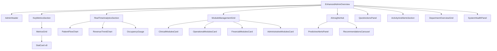
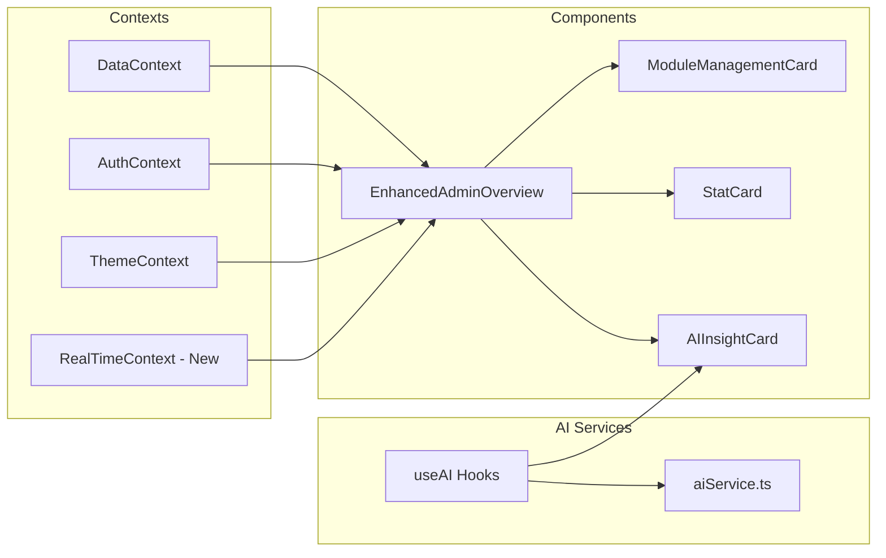
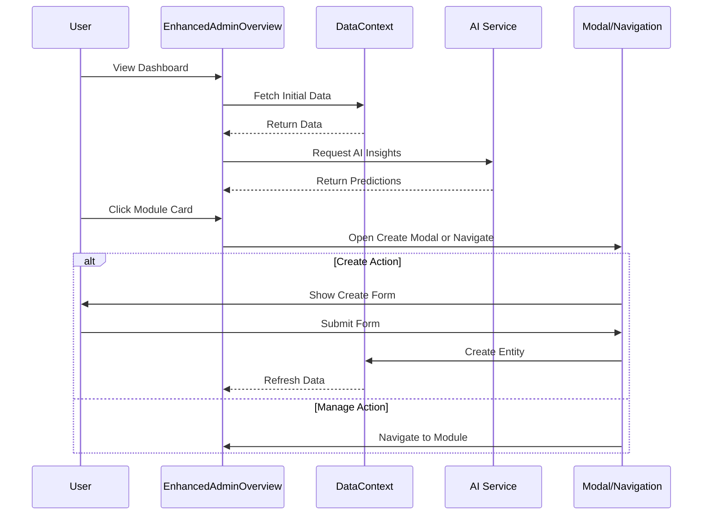

# Enhanced Admin Dashboard Overview - Design Document

## Executive Summary

This document outlines the comprehensive design for an enhanced Admin Dashboard Overview component for NexusHealth HMS. The design builds upon the existing [`AdminOverview.tsx`](components/AdminOverview.tsx:1) implementation, incorporating patterns from [`Dashboard.tsx`](components/Dashboard.tsx:1) and [`Analytics.tsx`](components/Analytics.tsx:1), while following the architectural guidelines specified in [`ADMIN_DASHBOARD_ARCHITECTURE.md`](docs/ADMIN_DASHBOARD_ARCHITECTURE.md:1).

---

## Table of Contents

1. [Current Implementation Analysis](#current-implementation-analysis)
2. [Proposed Component Architecture](#proposed-component-architecture)
3. [Key Metrics and Analytics](#key-metrics-and-analytics)
4. [Module Management Sections](#module-management-sections)
5. [UI/UX Recommendations](#uiux-recommendations)
6. [Data Requirements and Integration Points](#data-requirements-and-integration-points)
7. [Implementation Roadmap](#implementation-roadmap)

---

## Current Implementation Analysis

### Existing Components in AdminOverview.tsx

| Component | Lines | Purpose |
|-----------|-------|---------|
| [`StatCard`](components/AdminOverview.tsx:73) | 73-108 | Displays metric with trend indicator |
| [`AIInsightCard`](components/AdminOverview.tsx:125) | 125-216 | Shows AI-powered insights with expandable recommendations |
| [`QuickAction`](components/AdminOverview.tsx:229) | 229-248 | Action button with icon and description |
| [`ActivityItem`](components/AdminOverview.tsx:260) | 260-277 | Activity feed item with type-based styling |
| [`AdminOverview`](components/AdminOverview.tsx:282) | 282-810 | Main component orchestrating all sections |

### Current Sections

1. **Header** - Welcome message, system status indicator, generate report button
2. **Key Metrics Grid** - 4 primary stat cards (Patients, Beds, Staff, Appointments)
3. **Secondary Metrics Grid** - 4 additional stat cards (Tasks, Revenue, Pending Revenue, Alerts)
4. **AI Insights Section** - 4 AI-powered insight cards (Readmission Risk, Outbreak Detection, Inventory Forecast, Patient Flow)
5. **Quick Actions Panel** - 6 action buttons for common tasks
6. **Recent Activity Feed** - Live activity stream
7. **Department Summary** - 4 department status cards with capacity indicators

### Identified Gaps

1. **No module management capabilities** - Cannot create/manage entities directly
2. **Limited real-time updates** - Static data on initial load
3. **No drill-down navigation** - Metrics don't link to detail pages
4. **Missing comprehensive analytics** - Limited visualization beyond stat cards
5. **No administrative shortcuts** - Missing bulk operations and system controls

---

## Proposed Component Architecture

### Component Hierarchy

```
EnhancedAdminOverview/
+-- AdminHeader
|   +-- WelcomeSection
|   +-- SystemStatusIndicator
|   +-- GlobalActionsToolbar
+-- KeyMetricsSection
|   +-- MetricsGrid
|   |   +-- StatCard (8 cards)
|   +-- MetricTrendSparklines
+-- RealTimeAnalyticsSection
|   +-- PatientFlowChart
|   +-- RevenueTrendChart
|   +-- OccupancyGauge
|   +-- DepartmentPerformanceRadar
+-- AIInsightsHub
|   +-- PredictiveAlertsPanel
|   +-- RecommendationsCarousel
|   +-- AnomalyDetectionFeed
+-- ModuleManagementGrid
|   +-- ClinicalModulesCard
|   |   +-- ModuleQuickAccess (Patients, Appointments, OPD, Lab, Radiology)
|   +-- OperationalModulesCard
|   |   +-- ModuleQuickAccess (Bed Management, OT, Pharmacy, Housekeeping)
|   +-- FinancialModulesCard
|   |   +-- ModuleQuickAccess (Billing, Insurance, Revenue, Expenses)
|   +-- AdministrativeModulesCard
|   |   +-- ModuleQuickAccess (Staff, Audit, Security, Compliance)
+-- QuickActionsPanel
|   +-- EmergencyActions
|   +-- CreateEntityDropdown
|   +-- BulkOperationsToolbar
+-- ActivityAndAlertsSection
|   +-- RealTimeActivityFeed
|   +-- ActiveAlertsList
|   +-- PendingApprovalsQueue
+-- DepartmentOverviewGrid
|   +-- DepartmentCard (expandable)
|   |   +-- CapacityIndicator
|   |   +-- StaffingLevel
|   |   +-- QuickActions
+-- SystemHealthPanel
    +-- ServerStatusIndicator
    +-- DatabaseHealthGauge
    +-- IntegrationStatusList
```

### New Component Definitions

#### 1. ModuleManagementCard

```typescript
interface ModuleManagementCardProps {
  title: string;
  icon: React.ReactNode;
  modules: ModuleConfig[];
  color: string;
  onModuleClick: (module: string) => void;
  onCreateNew: (module: string) => void;
}

interface ModuleConfig {
  id: string;
  name: string;
  icon: React.ReactNode;
  count?: number;
  status?: 'active' | 'warning' | 'critical';
  createLabel: string;
  manageLabel: string;
}
```

#### 2. RealTimeChart

```typescript
interface RealTimeChartProps {
  data: ChartDataPoint[];
  dataKey: string;
  title: string;
  color: string;
  updateInterval?: number;
  showSparkline?: boolean;
}
```

#### 3. AlertPanel

```typescript
interface AlertPanelProps {
  alerts: Alert[];
  onDismiss: (alertId: string) => void;
  onAction: (alertId: string, action: string) => void;
  maxVisible?: number;
  groupBySeverity?: boolean;
}

interface Alert {
  id: string;
  type: 'critical' | 'warning' | 'info';
  message: string;
  source: string;
  timestamp: Date;
  actions?: AlertAction[];
}
```

#### 4. CreateEntityDropdown

```typescript
interface CreateEntityDropdownProps {
  entities: EntityConfig[];
  onCreate: (entityType: string) => void;
  recentTypes?: string[];
}

interface EntityConfig {
  type: string;
  label: string;
  icon: React.ReactNode;
  shortcut?: string;
  requiredPermission?: string;
}
```

---

## Key Metrics and Analytics

### Primary Metrics (Top Row)

| Metric | Data Source | Calculation | Display Format |
|--------|-------------|-------------|----------------|
| Total Patients | `patients[]` | `patients.length` | Number + trend |
| Active Inpatients | `patients.filter(p => p.roomNumber)` | Filtered count | Number + percentage |
| Critical Patients | `patients.filter(p => p.urgency === 'CRITICAL')` | Filtered count | Number (red highlight) |
| Bed Occupancy | `beds[]` | `(occupied/total) * 100` | Percentage + gauge |
| Staff on Duty | `staff[]` | `filter(s => s.status === 'Online')` | Number + shift indicator |
| Today's Appointments | `appointments[]` | `filter(a => a.date === 'Today')` | Number + queue length |
| Daily Revenue | `invoices[]` | Sum of collected today | Currency + trend |
| Active Alerts | Multiple sources | Aggregated count | Number by severity |

### Secondary Metrics (Expandable Section)

| Metric | Data Source | Purpose |
|--------|-------------|---------|
| Average Length of Stay | `patients[]` | Operational efficiency |
| Readmission Rate (30-day) | `patients[]` | Quality indicator |
| Patient Satisfaction Score | `feedback[]` | Service quality |
| Pending Insurance Claims | `insuranceClaims[]` | Financial tracking |
| Low Stock Items | `inventory[]` | Supply chain alerts |
| Scheduled Surgeries | `otSchedule[]` | OR capacity planning |
| Lab Results Pending | `labOrders[]` | Workflow monitoring |
| Emergency Wait Time | `opdQueue[]` | Patient experience |

### Real-Time Analytics Charts

#### Patient Flow Chart
- **Type**: Area Chart (Recharts)
- **Data**: Hourly patient volume for last 24 hours
- **Update Frequency**: Every 5 minutes
- **Source**: [`usePatientFlowAnalytics`](hooks/useAI.ts:46) hook

#### Revenue Trend Chart
- **Type**: Composed Chart (Bar + Line)
- **Data**: Daily revenue and profit for last 30 days
- **Update Frequency**: Daily
- **Source**: `invoices[]` from DataContext

#### Occupancy Gauge
- **Type**: Radial Gauge
- **Data**: Current bed occupancy percentage
- **Update Frequency**: Real-time
- **Source**: `beds[]` from DataContext

#### Department Performance Radar
- **Type**: Radar Chart
- **Data**: Multi-dimensional performance metrics per department
- **Dimensions**: Patient Volume, Revenue, Efficiency, Satisfaction, Staff Utilization

---

## Module Management Sections

### Clinical Modules Card

```
+-----------------------------------------------+
|  CLINICAL MODULES                    [+] Create|
+-----------------------------------------------+
|                                               |
|  [Patients]     [Appointments]    [OPD Queue] |
|   1,245 pts      48 today         12 waiting  |
|   Manage | Add   Manage | Add     Manage      |
|                                               |
|  [Lab]          [Radiology]       [Pharmacy]  |
|   23 pending     8 pending        156 items   |
|   Manage | Add   Manage | Add     Manage | Add|
|                                               |
+-----------------------------------------------+
```

**Modules Included:**
| Module | Create Action | Manage Action | Data Source |
|--------|--------------|---------------|-------------|
| Patients | Add Patient | View All Patients | `patients[]` |
| Appointments | Schedule Appointment | Manage Schedule | `appointments[]` |
| OPD Queue | Add to Queue | Manage Queue | `opdQueue[]` |
| Lab | Create Order | Manage Lab | `labOrders[]` |
| Radiology | Create Order | Manage Radiology | `radiologyOrders[]` |
| Pharmacy | Add Medicine | Manage Pharmacy | `inventory[]` |

### Operational Modules Card

```
+-----------------------------------------------+
|  OPERATIONAL MODULES                  [+] Create|
+-----------------------------------------------+
|                                               |
|  [Bed Mgmt]     [OT Schedule]     [Housekeeping]|
|   84% occupied   3 surgeries      8 pending   |
|   Manage         Manage | Add     Manage      |
|                                               |
|  [Assets]       [Facility]         [Waste]    |
|   45 active      2 maintenance    3 pending  |
|   Manage | Add   Manage | Add     Manage      |
|                                               |
+-----------------------------------------------+
```

**Modules Included:**
| Module | Create Action | Manage Action | Data Source |
|--------|--------------|---------------|-------------|
| Bed Management | Add Bed | Manage Beds | `beds[]` |
| OT Schedule | Schedule Surgery | Manage OT | `otSchedule[]` |
| Housekeeping | Create Task | Manage Tasks | `housekeepingTasks[]` |
| Assets | Add Asset | Manage Assets | `assets[]` |
| Facility Maintenance | Create Request | Manage Requests | `maintenanceRequests[]` |
| Waste Management | Create Record | Manage Records | `wasteRecords[]` |

### Financial Modules Card

```
+-----------------------------------------------+
|  FINANCIAL MODULES                    [+] Create|
+-----------------------------------------------+
|                                               |
|  [Billing]      [Insurance]        [Revenue]  |
|   12 pending     8 claims          $124,500   |
|   Manage | Add   Manage | Add      Manage      |
|                                               |
|  [Expenses]     [Payroll]          [Audit]    |
|   $45,200        Processed         156 logs   |
|   Manage | Add   Manage            View Logs  |
|                                               |
+-----------------------------------------------+
```

**Modules Included:**
| Module | Create Action | Manage Action | Data Source |
|--------|--------------|---------------|-------------|
| Billing | Create Invoice | Manage Billing | `invoices[]` |
| Insurance Claims | Create Claim | Manage Claims | `insuranceClaims[]` |
| Revenue | Add Entry | Revenue Analytics | `revenueData[]` |
| Expenses | Add Expense | Manage Expenses | `expenses[]` |
| Payroll | Process Payroll | Manage Payroll | `payrollData[]` |
| Audit Logs | N/A | View Logs | `auditLogs[]` |

### Administrative Modules Card

```
+-----------------------------------------------+
|  ADMINISTRATIVE MODULES               [+] Create|
+-----------------------------------------------+
|                                               |
|  [Staff]        [Shift Roster]     [Notices]  |
|   250 total      3 shifts         5 active   |
|   Manage | Add   Manage | Add     Manage | Add|
|                                               |
|  [Security]     [Compliance]       [Settings] |
|   2 alerts       98% score         System     |
|   Manage         View Report       Configure  |
|                                               |
+-----------------------------------------------+
```

**Modules Included:**
| Module | Create Action | Manage Action | Data Source |
|--------|--------------|---------------|-------------|
| Staff Directory | Add Staff | Manage Staff | `staff[]` |
| Shift Roster | Create Shift | Manage Roster | `shiftRoster[]` |
| Notice Board | Create Notice | Manage Notices | `notices[]` |
| Security Monitor | N/A | View Security | `securityEvents[]` |
| Compliance | N/A | View Compliance | `complianceData[]` |
| Settings | N/A | Configure System | `systemConfig` |

---

## UI/UX Recommendations

### Design Principles

1. **Consistency with Existing Patterns**
   - Use the same [`StatCard`](components/AdminOverview.tsx:73) styling and structure
   - Maintain the rounded-2xl border radius pattern
   - Follow the color scheme: teal (primary), blue, purple, amber, red (alerts)

2. **Visual Hierarchy**
   - Primary metrics: Large cards with prominent numbers
   - Secondary metrics: Compact cards in expandable section
   - AI Insights: Distinctive purple-themed styling with AI badge
   - Module cards: Grouped by category with consistent layout

3. **Responsive Design**
   - Grid layout: 4 columns on desktop, 2 on tablet, 1 on mobile
   - Collapsible sections for mobile view
   - Horizontal scroll for module cards on small screens

### Color Scheme

| Element | Light Mode | Dark Mode | Usage |
|---------|------------|-----------|-------|
| Primary | `teal-600` | `teal-400` | Actions, highlights |
| Success | `green-600` | `green-400` | Positive trends |
| Warning | `amber-600` | `amber-400` | Warnings, pending |
| Critical | `red-600` | `red-400` | Alerts, critical |
| Info | `blue-600` | `blue-400` | Information |
| AI Accent | `purple-600` | `purple-400` | AI features |

### Animation Guidelines

```typescript
// Page load animation
const pageVariants = {
  initial: { opacity: 0, y: 20 },
  animate: { opacity: 1, y: 0 },
  exit: { opacity: 0, y: -20 }
};

// Card hover effect
const cardHover = {
  scale: 1.02,
  transition: { duration: 0.2 }
};

// Number counter animation
const animateValue = (start, end, duration) => {
  // Smooth number transition for metrics
};
```

### Accessibility Considerations

1. **ARIA Labels**: All interactive elements must have descriptive labels
2. **Keyboard Navigation**: Full keyboard support for all actions
3. **Color Contrast**: Minimum 4.5:1 ratio for text
4. **Focus Indicators**: Visible focus states on all interactive elements
5. **Screen Reader Support**: Semantic HTML structure

### Dark Mode Support

All components must support dark mode using the existing pattern:
```tsx
className="bg-white dark:bg-slate-800 text-slate-800 dark:text-white"
```

---

## Data Requirements and Integration Points

### DataContext Integration

The enhanced component will utilize the existing [`DataContext`](src/contexts/DataContext.tsx:1) for all data needs:

```typescript
const {
  patients,
  appointments,
  beds,
  staff,
  tasks,
  invoices,
  inventory,
  opdQueue,
  insuranceClaims,
  labOrders,
  radiologyOrders,
  otSchedule,
  housekeepingTasks,
  assets,
  maintenanceRequests,
  wasteRecords,
  expenses,
  shiftRoster,
  notices,
  auditLogs,
  getStats,
} = useData();
```

### AI Hooks Integration

Leverage existing AI hooks from [`useAI.ts`](hooks/useAI.ts:1):

```typescript
const readmissionRisk = useReadmissionRiskPredictor();
const outbreakDetection = useOutbreakDetection();
const inventoryForecast = useInventoryForecast();
const patientFlow = usePatientFlowAnalytics();
const reportingAssistant = useReportingAssistant();
```

### New Integration Points

#### 1. Real-Time Updates Context

```typescript
// Proposed new context for real-time data
interface RealTimeContextType {
  subscribe: (channel: string) => void;
  unsubscribe: (channel: string) => void;
  lastUpdate: Date;
  connectionStatus: 'connected' | 'disconnected' | 'reconnecting';
}
```

#### 2. Module Navigation Handler

```typescript
// Navigation handler for module access
const handleModuleNavigation = (module: string, action: 'create' | 'manage') => {
  if (action === 'create') {
    // Open create modal or navigate to create page
    openCreateModal(module);
  } else {
    // Navigate to module management page
    setActiveTab(module);
  }
};
```

#### 3. Create Entity Modal System

```typescript
// Centralized modal management
interface CreateModalConfig {
  entityType: string;
  fields: FieldConfig[];
  onSubmit: (data: any) => Promise<void>;
  validation: ValidationRules;
}
```

### API Endpoints (Future Implementation)

| Endpoint | Method | Purpose |
|----------|--------|---------|
| `/api/admin/metrics` | GET | Fetch aggregated metrics |
| `/api/admin/alerts` | GET | Fetch active alerts |
| `/api/admin/realtime` | WebSocket | Real-time updates stream |
| `/api/admin/modules/{module}` | POST | Create new entity in module |
| `/api/admin/bulk-operations` | POST | Execute bulk operations |

---

## Implementation Roadmap

### Phase 1: Core Enhancements

1. **Expand Metrics Section**
   - Add secondary metrics row
   - Implement trend sparklines
   - Add click-through navigation to detail pages

2. **Enhance Quick Actions**
   - Add Create Entity dropdown
   - Implement keyboard shortcuts
   - Add recent actions history

3. **Improve AI Insights**
   - Add loading states with skeletons
   - Implement refresh functionality
   - Add insight history

### Phase 2: Module Management

1. **Implement Module Cards**
   - Create ModuleManagementCard component
   - Add create/manage action handlers
   - Implement modal system for quick creates

2. **Add Navigation Integration**
   - Connect to existing routing system
   - Implement tab switching
   - Add breadcrumb navigation

### Phase 3: Real-Time Features

1. **Real-Time Charts**
   - Implement auto-refreshing charts
   - Add connection status indicator
   - Implement offline fallback

2. **Live Activity Feed**
   - WebSocket integration
   - Real-time notifications
   - Activity filtering

### Phase 4: Advanced Features

1. **Customizable Dashboard**
   - Drag-and-drop widget arrangement
   - Save/load layouts
   - User preferences persistence

2. **Export and Reporting**
   - PDF report generation
   - Data export (CSV, Excel)
   - Scheduled reports

---

## Mermaid Diagrams

### Component Flow Diagram



### Data Flow Diagram



### User Interaction Flow



---

## Conclusion

This design document provides a comprehensive blueprint for enhancing the Admin Dashboard Overview component. The proposed architecture:

1. **Maintains consistency** with existing component patterns
2. **Adds module management capabilities** with create/manage actions
3. **Integrates real-time analytics** with live data visualization
4. **Leverages existing AI infrastructure** for predictive insights
5. **Follows established UI/UX patterns** from the codebase

The implementation should be phased to allow for iterative development and testing, with core enhancements delivered first, followed by advanced features.

---

## Appendix: File References

| File | Purpose |
|------|---------|
| [`components/AdminOverview.tsx`](components/AdminOverview.tsx:1) | Current implementation to enhance |
| [`components/Dashboard.tsx`](components/Dashboard.tsx:1) | Pattern reference for role-based dashboards |
| [`components/Analytics.tsx`](components/Analytics.tsx:1) | Chart and visualization patterns |
| [`docs/ADMIN_DASHBOARD_ARCHITECTURE.md`](docs/ADMIN_DASHBOARD_ARCHITECTURE.md:1) | Architecture guidelines |
| [`hooks/useAI.ts`](hooks/useAI.ts:1) | AI hooks for predictive features |
| [`src/contexts/DataContext.tsx`](src/contexts/DataContext.tsx:1) | Data management context |
| [`App.tsx`](App.tsx:1) | Routing and navigation structure |