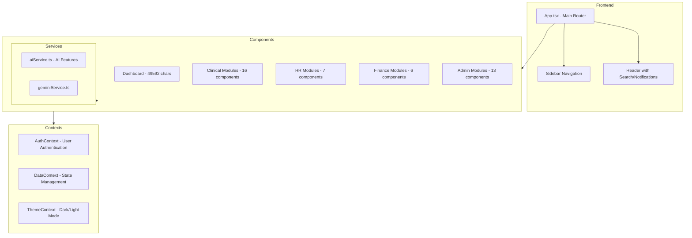
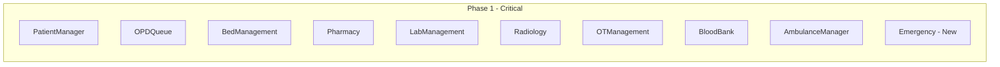
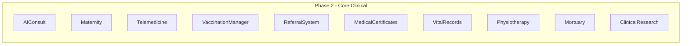
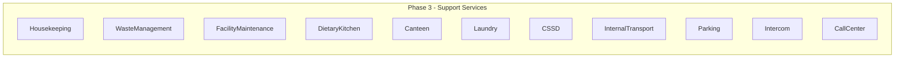
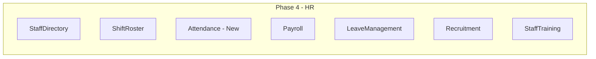
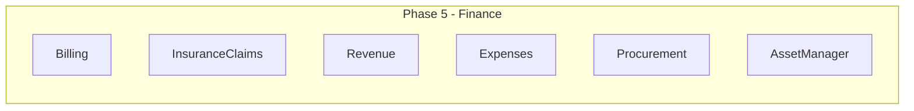
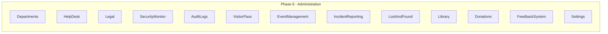
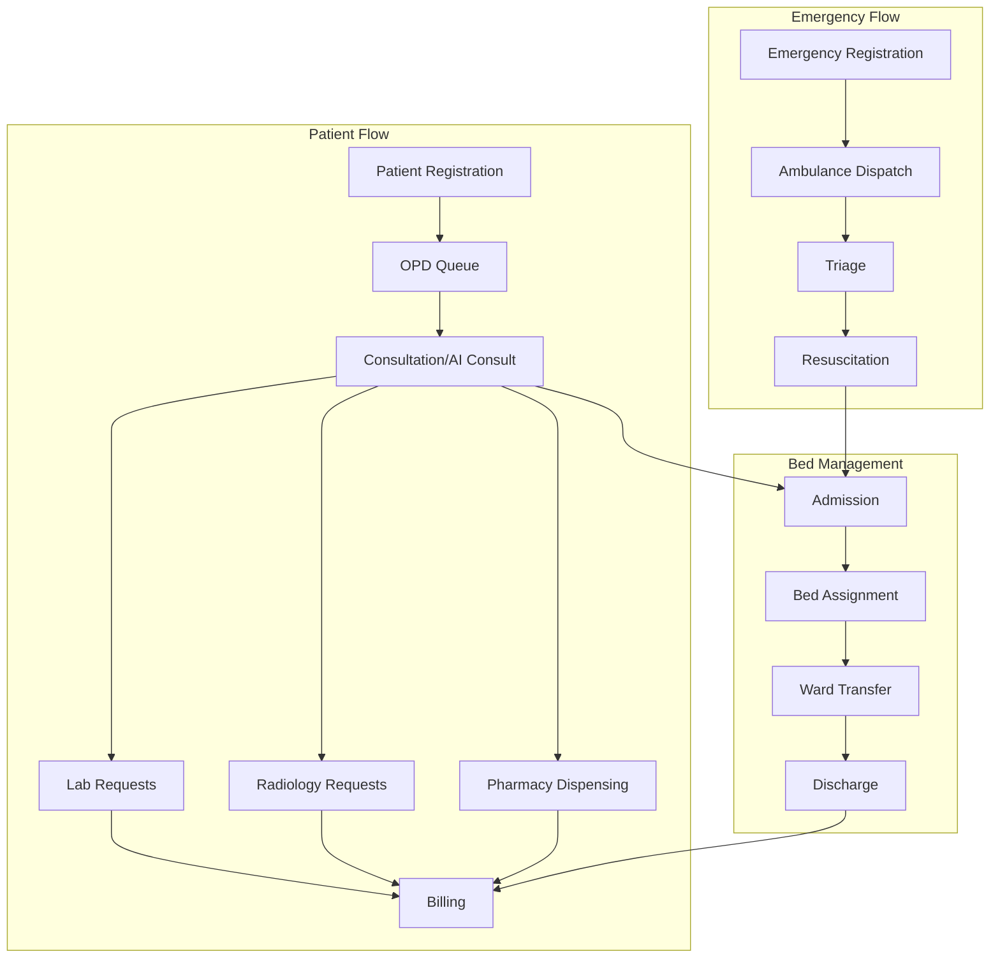

# NexusHealth HMS - Comprehensive Implementation Plan

## Executive Summary

This document outlines a detailed implementation plan for enhancing NexusHealth Hospital Management System with full CRUD functionality across all 50+ modules. The plan prioritizes patient-care critical modules and establishes a standardized component architecture.

---

## 1. Current State Analysis

### 1.1 Architecture Overview



### 1.2 Component Maturity Assessment

| Category | Mature Components | Partial Implementation | Needs Complete Rewrite |
|----------|------------------|----------------------|----------------------|
| Dashboard | Dashboard, Analytics, Schedule | TaskManager, NoticeBoard | - |
| Clinical | Pharmacy, LabManagement, Radiology, OPDQueue, AIConsult, Maternity, OTManagement | PatientManager, BedManagement, Telemedicine, ReferralSystem, MedicalCertificates, ClinicalResearch, VitalRecords | Physiotherapy, VaccinationManager, Mortuary |
| Services | Pharmacy, Housekeeping, WasteManagement, FacilityMaintenance, AmbulanceManager | BloodBank, InternalTransport, CSSD, DietaryKitchen, Canteen, Laundry, CallCenter, Intercom, Parking | - |
| HR | ShiftRoster, Recruitment | StaffDirectory, Payroll, LeaveManagement, StaffTraining | - |
| Finance | Billing, InsuranceClaims, Revenue | Expenses, Procurement, AssetManager | - |
| Admin | AuditLogs, Legal, SecurityMonitor | Departments, HelpDesk, VisitorPass, EventManagement, IncidentReporting, LostAndFound, Library, Donations, FeedbackSystem, Settings | - |

### 1.3 Key Gaps Identified

1. **Missing CRUD Operations**
   - Most components only have Create functionality
   - Update operations limited to TaskManager and BedManagement
   - Delete operations missing in most modules
   - No bulk operations

2. **Missing DataContext Integration**
   - BloodBank uses local MOCK_BLOOD instead of context
   - Many small components have hardcoded data
   - Inconsistent state management

3. **Missing UI Features**
   - No search functionality in small components
   - No filter/sort capabilities
   - No pagination for large datasets
   - No export/print functionality
   - No confirmation dialogs for destructive actions

4. **Missing Form Handling**
   - No form validation
   - No error handling
   - No loading states for async operations

---

## 2. Standard Component Architecture

### 2.1 Component Structure Template

Every module should follow this standardized structure:

```typescript
// Standard Component Structure
interface ComponentProps {
  // Optional props for embedded usage
  embedded?: boolean;
  initialData?: SomeType[];
}

const StandardModule: React.FC<ComponentProps> = ({ embedded = false }) => {
  // 1. Hooks - Context and State
  const { user } = useAuth();
  const { theme } = useTheme();
  const { items, addItem, updateItem, deleteItem } = useData();
  
  // 2. Local State
  const [activeTab, setActiveTab] = useState<'list' | 'grid' | 'details'>('list');
  const [searchTerm, setSearchTerm] = useState('');
  const [filterStatus, setFilterStatus] = useState<string>('all');
  const [sortBy, setSortBy] = useState<string>('date');
  const [sortOrder, setSortOrder] = useState<'asc' | 'desc'>('desc');
  const [selectedItem, setSelectedItem] = useState<Item | null>(null);
  const [isModalOpen, setIsModalOpen] = useState(false);
  const [modalMode, setModalMode] = useState<'create' | 'edit' | 'view'>('create');
  const [deleteConfirmId, setDeleteConfirmId] = useState<string | null>(null);
  const [currentPage, setCurrentPage] = useState(1);
  const itemsPerPage = 10;
  
  // 3. Derived Data
  const filteredItems = useMemo(() => {
    return items
      .filter(item => 
        item.name.toLowerCase().includes(searchTerm.toLowerCase()) ||
        item.id.toLowerCase().includes(searchTerm.toLowerCase())
      )
      .filter(item => filterStatus === 'all' || item.status === filterStatus)
      .sort((a, b) => {
        const aVal = a[sortBy];
        const bVal = b[sortBy];
        return sortOrder === 'asc' 
          ? String(aVal).localeCompare(String(bVal))
          : String(bVal).localeCompare(String(aVal));
      });
  }, [items, searchTerm, filterStatus, sortBy, sortOrder]);
  
  const paginatedItems = useMemo(() => {
    const start = (currentPage - 1) * itemsPerPage;
    return filteredItems.slice(start, start + itemsPerPage);
  }, [filteredItems, currentPage]);
  
  const totalPages = Math.ceil(filteredItems.length / itemsPerPage);
  
  // 4. Handlers
  const handleCreate = () => {
    setSelectedItem(null);
    setModalMode('create');
    setIsModalOpen(true);
  };
  
  const handleEdit = (item: Item) => {
    setSelectedItem(item);
    setModalMode('edit');
    setIsModalOpen(true);
  };
  
  const handleView = (item: Item) => {
    setSelectedItem(item);
    setModalMode('view');
    setIsModalOpen(true);
  };
  
  const handleDelete = (id: string) => {
    setDeleteConfirmId(id);
  };
  
  const confirmDelete = () => {
    if (deleteConfirmId) {
      deleteItem(deleteConfirmId);
      setDeleteConfirmId(null);
    }
  };
  
  const handleFormSubmit = (data: ItemFormData) => {
    if (modalMode === 'create') {
      addItem({ ...data, id: generateId() });
    } else if (modalMode === 'edit' && selectedItem) {
      updateItem(selectedItem.id, data);
    }
    setIsModalOpen(false);
  };
  
  // 5. Effects
  useEffect(() => {
    // Reset to first page when filters change
    setCurrentPage(1);
  }, [searchTerm, filterStatus]);
  
  // 6. Render
  return (
    <div className="space-y-6 animate-fade-in">
      {/* Header */}
      <ModuleHeader
        title="Module Name"
        description="Module description"
        onAdd={handleCreate}
        addButtonText="Add Item"
      />
      
      {/* Stats Cards */}
      <StatsGrid items={items} />
      
      {/* Filters and Search */}
      <FilterBar
        searchTerm={searchTerm}
        onSearchChange={setSearchTerm}
        filterOptions={filterOptions}
        activeFilter={filterStatus}
        onFilterChange={setFilterStatus}
        sortBy={sortBy}
        onSortChange={setSortBy}
        sortOrder={sortOrder}
        onSortOrderChange={setSortOrder}
        viewMode={activeTab}
        onViewModeChange={setActiveTab}
      />
      
      {/* Content */}
      {activeTab === 'list' && (
        <DataTable
          data={paginatedItems}
          columns={columns}
          onRowClick={handleView}
          onEdit={handleEdit}
          onDelete={handleDelete}
        />
      )}
      
      {activeTab === 'grid' && (
        <CardGrid
          data={paginatedItems}
          onCardClick={handleView}
          onEdit={handleEdit}
          onDelete={handleDelete}
        />
      )}
      
      {/* Pagination */}
      <Pagination
        currentPage={currentPage}
        totalPages={totalPages}
        onPageChange={setCurrentPage}
        totalItems={filteredItems.length}
      />
      
      {/* Modal */}
      <FormModal
        isOpen={isModalOpen}
        onClose={() => setIsModalOpen(false)}
        mode={modalMode}
        initialData={selectedItem}
        onSubmit={handleFormSubmit}
      />
      
      {/* Delete Confirmation */}
      <ConfirmDialog
        isOpen={!!deleteConfirmId}
        onClose={() => setDeleteConfirmId(null)}
        onConfirm={confirmDelete}
        title="Confirm Delete"
        message="Are you sure you want to delete this item?"
      />
    </div>
  );
};
```

### 2.2 Required Features Checklist

Every module MUST include:

- [ ] **CRUD Operations**
  - [ ] Create with form validation
  - [ ] Read/View with detail modal/drawer
  - [ ] Update/Edit functionality
  - [ ] Delete with confirmation dialog
  - [ ] Bulk operations where applicable

- [ ] **Search & Filter**
  - [ ] Global search across relevant fields
  - [ ] Status filter dropdown
  - [ ] Date range filter where applicable
  - [ ] Category/type filter where applicable

- [ ] **Sorting & Pagination**
  - [ ] Sortable columns
  - [ ] Sort direction toggle
  - [ ] Pagination with configurable page size
  - [ ] Items count display

- [ ] **UI Components**
  - [ ] Stats cards showing key metrics
  - [ ] List view with table
  - [ ] Grid view with cards
  - [ ] Detail view modal/drawer
  - [ ] Form modal for create/edit
  - [ ] Delete confirmation dialog
  - [ ] Empty state display
  - [ ] Loading states
  - [ ] Error states

- [ ] **Data Integration**
  - [ ] Connected to DataContext
  - [ ] Proper TypeScript types
  - [ ] Optimistic updates where appropriate

- [ ] **Accessibility**
  - [ ] Keyboard navigation
  - [ ] ARIA labels
  - [ ] Focus management in modals

---

## 3. Implementation Priority

### Phase 1: Critical Patient-Care Modules (Highest Priority)

These modules directly impact patient care and safety.



| Module | Current State | Required Enhancements | Complexity |
|--------|--------------|----------------------|------------|
| **PatientManager** | Partial - 7530 chars | Full CRUD, search, patient history, document upload | High |
| **OPDQueue** | Good - 35368 chars | Add edit/delete, AI triage integration, real-time updates | Medium |
| **BedManagement** | Good - 27922 chars | Add ward management, transfer tracking, cleaning status | Medium |
| **Pharmacy** | Excellent - 95678 chars | Minor enhancements, inventory alerts, expiry tracking | Low |
| **LabManagement** | Good - 44222 chars | Add result entry, critical value alerts, barcode integration | Medium |
| **Radiology** | Good - 42332 chars | Add image viewer integration, report templates | Medium |
| **OTManagement** | Good - 22883 chars | Add scheduling, equipment tracking, staff assignment | Medium |
| **BloodBank** | Minimal - 3577 chars | Complete rewrite with full CRUD, cross-match tracking | High |
| **AmbulanceManager** | Good - 16888 chars | Add GPS tracking, dispatch system, crew management | Medium |
| **Emergency** | Missing | New module - triage, critical alerts, resource tracking | High |

### Phase 2: Core Clinical Modules



| Module | Current State | Required Enhancements | Complexity |
|--------|--------------|----------------------|------------|
| **AIConsult** | Excellent - 70949 chars | Minor enhancements, better AI integration | Low |
| **Maternity** | Good - 31034 chars | Add delivery tracking, NICU integration | Medium |
| **Telemedicine** | Partial - 7799 chars | Add video integration, e-prescription | High |
| **VaccinationManager** | Minimal - 3066 chars | Complete rewrite with schedule tracking | High |
| **ReferralSystem** | Partial - 8317 chars | Add tracking, communication, feedback | Medium |
| **MedicalCertificates** | Good - 18498 chars | Add templates, digital signature | Low |
| **VitalRecords** | Minimal - 3468 chars | Complete rewrite with birth/death registry | High |
| **Physiotherapy** | Minimal - 2468 chars | Complete rewrite with session tracking | High |
| **Mortuary** | Minimal - 3282 chars | Complete rewrite with body tracking | High |
| **ClinicalResearch** | Good - 21149 chars | Add consent management, data export | Medium |

### Phase 3: Support Services



| Module | Current State | Required Enhancements | Complexity |
|--------|--------------|----------------------|------------|
| **Housekeeping** | Good - 21334 chars | Add scheduling, quality checks | Low |
| **WasteManagement** | Good - 20489 chars | Add compliance tracking, reports | Low |
| **FacilityMaintenance** | Good - 32272 chars | Add preventive maintenance, asset linking | Medium |
| **DietaryKitchen** | Minimal - 2808 chars | Complete rewrite with meal planning | High |
| **Canteen** | Minimal - 3104 chars | Complete rewrite with POS integration | High |
| **Laundry** | Minimal - 2414 chars | Complete rewrite with tracking | Medium |
| **CSSD** | Minimal - 3543 chars | Complete rewrite with sterilization tracking | High |
| **InternalTransport** | Minimal - 3102 chars | Complete rewrite with request system | Medium |
| **Parking** | Minimal - 2891 chars | Complete rewrite with slot management | Medium |
| **Intercom** | Minimal - 2560 chars | Complete rewrite with directory | Medium |
| **CallCenter** | Minimal - 2911 chars | Complete rewrite with call logging | High |

### Phase 4: Human Resources



| Module | Current State | Required Enhancements | Complexity |
|--------|--------------|----------------------|------------|
| **StaffDirectory** | Minimal - 3657 chars | Complete rewrite with profiles, documents | High |
| **ShiftRoster** | Good - 16738 chars | Add shift swapping, overtime tracking | Medium |
| **Attendance** | Missing | New module - biometric integration, reports | High |
| **Payroll** | Minimal - 4045 chars | Complete rewrite with salary structure | High |
| **LeaveManagement** | Minimal - 4811 chars | Complete rewrite with approval workflow | Medium |
| **Recruitment** | Good - 11196 chars | Add job postings, application tracking | Medium |
| **StaffTraining** | Minimal - 2759 chars | Complete rewrite with LMS features | High |

### Phase 5: Finance



| Module | Current State | Required Enhancements | Complexity |
|--------|--------------|----------------------|------------|
| **Billing** | Good - 18737 chars | Add payment gateway, claims integration | Medium |
| **InsuranceClaims** | Good - 17020 chars | Add pre-authorization, tracking | Medium |
| **Revenue** | Good - 16307 chars | Add forecasting, department-wise breakdown | Low |
| **Expenses** | Minimal - 5450 chars | Complete rewrite with approval workflow | High |
| **Procurement** | Partial - 8355 chars | Add vendor management, PO tracking | Medium |
| **AssetManager** | Good - 23296 chars | Add depreciation, maintenance schedule | Medium |

### Phase 6: Administration



| Module | Current State | Required Enhancements | Complexity |
|--------|--------------|----------------------|------------|
| **Departments** | Minimal - 3063 chars | Complete rewrite with hierarchy | Medium |
| **HelpDesk** | Minimal - 2604 chars | Complete rewrite with ticket system | High |
| **Legal** | Good - 19921 chars | Add document management, case tracking | Low |
| **SecurityMonitor** | Partial - 8126 chars | Add CCTV integration, visitor tracking | Medium |
| **AuditLogs** | Good - 21773 chars | Add export, filtering, compliance reports | Low |
| **VisitorPass** | Minimal - 2814 chars | Complete rewrite with pass generation | Medium |
| **EventManagement** | Minimal - 2777 chars | Complete rewrite with calendar | Medium |
| **IncidentReporting** | Minimal - 3160 chars | Complete rewrite with workflow | Medium |
| **LostAndFound** | Minimal - 3294 chars | Complete rewrite with image upload | Low |
| **Library** | Minimal - 2604 chars | Complete rewrite with catalog | Medium |
| **Donations** | Minimal - 2926 chars | Complete rewrite with tracking | Low |
| **FeedbackSystem** | Minimal - 2434 chars | Complete rewrite with analytics | Medium |
| **Settings** | Minimal - 3592 chars | Complete rewrite with all settings | High |

### Phase 7: Dashboard Enhancements

| Module | Current State | Required Enhancements | Complexity |
|--------|--------------|----------------------|------------|
| **Dashboard** | Excellent - 49592 chars | Add role-based dashboards, widgets | Medium |
| **Analytics** | Good - 15144 chars | Add custom reports, export | Low |
| **Schedule** | Good - 13864 chars | Add calendar views, reminders | Low |
| **TaskManager** | Minimal - 3375 chars | Complete rewrite with Kanban, assignments | Medium |
| **NoticeBoard** | Minimal - 2004 chars | Complete rewrite with categories, pinning | Low |

---

## 4. Data Model Extensions

### 4.1 Required DataContext Additions

```typescript
// Additional data types needed in DataContext
interface DataContextType {
  // Existing...
  
  // Clinical additions
  bloodUnits: BloodUnit[];
  vaccinations: Vaccination[];
  therapySessions: TherapySession[];
  mortuaryRecords: MortuaryRecord[];
  
  // Services additions
  kitchenOrders: KitchenOrder[];
  canteenItems: CanteenItem[];
  laundryBatches: LaundryBatch[];
  sterilizationBatches: SterilizationBatch[];
  transportRequests: TransportRequest[];
  parkingSpots: ParkingSpot[];
  intercomLogs: IntercomLog[];
  callLogs: CallLog[];
  
  // HR additions
  staffProfiles: StaffProfile[];
  attendance: AttendanceRecord[];
  leaveRequests: LeaveRequest[];
  trainingModules: TrainingModule[];
  
  // Finance additions
  expenseRequests: ExpenseRequest[];
  purchaseOrders: PurchaseOrder[];
  
  // Admin additions
  departments: Department[];
  supportTickets: SupportTicket[];
  incidents: Incident[];
  libraryItems: LibraryItem[];
  donations: Donation[];
  feedbackItems: Feedback[];
  hospitalEvents: HospitalEvent[];
  lostItems: LostItem[];
  visitors: Visitor[];
  securityLogs: SecurityLog[];
  
  // CRUD methods for each
  addBloodUnit: (unit: BloodUnit) => void;
  updateBloodUnit: (id: string, data: Partial<BloodUnit>) => void;
  deleteBloodUnit: (id: string) => void;
  // ... and so on for each type
}
```

### 4.2 New Type Definitions Needed

```typescript
// Staff Profile for HR
interface StaffProfile {
  id: string;
  name: string;
  email: string;
  phone: string;
  department: string;
  designation: string;
  joinDate: string;
  salary: number;
  status: 'Active' | 'On Leave' | 'Terminated';
  documents: Document[];
  qualifications: Qualification[];
}

// Attendance Record
interface AttendanceRecord {
  id: string;
  staffId: string;
  date: string;
  checkIn: string;
  checkOut: string;
  status: 'Present' | 'Absent' | 'Late' | 'Half Day';
  overtime: number;
}

// Leave Request
interface LeaveRequest {
  id: string;
  staffId: string;
  type: 'Annual' | 'Sick' | 'Maternity' | 'Paternity' | 'Unpaid';
  startDate: string;
  endDate: string;
  reason: string;
  status: 'Pending' | 'Approved' | 'Rejected';
  approvedBy?: string;
}

// Expense Request
interface ExpenseRequest {
  id: string;
  department: string;
  category: string;
  amount: number;
  description: string;
  date: string;
  status: 'Pending' | 'Approved' | 'Rejected' | 'Paid';
  approvedBy?: string;
  attachments: string[];
}

// Purchase Order
interface PurchaseOrder {
  id: string;
  vendorId: string;
  items: POItem[];
  totalAmount: number;
  status: 'Draft' | 'Submitted' | 'Approved' | 'Received';
  createdAt: string;
  approvedBy?: string;
}
```

---

## 5. Integration Points

### 5.1 Cross-Module Dependencies



### 5.2 Data Flow Between Modules

| Source Module | Target Module | Data Shared |
|--------------|---------------|-------------|
| PatientManager | All Clinical | Patient demographics, history |
| OPDQueue | LabManagement | Lab test orders |
| OPDQueue | Radiology | Radiology requests |
| OPDQueue | Pharmacy | Prescriptions |
| LabManagement | PatientManager | Lab results |
| Radiology | PatientManager | Radiology reports |
| BedManagement | Housekeeping | Cleaning requests |
| Pharmacy | Billing | Medication charges |
| LabManagement | Billing | Lab charges |
| Radiology | Billing | Radiology charges |
| StaffDirectory | ShiftRoster | Staff availability |
| ShiftRoster | Payroll | Work hours, overtime |
| Procurement | AssetManager | New assets |
| AssetManager | FacilityMaintenance | Maintenance requests |

### 5.3 Shared Components

Create reusable components to be used across modules:

```typescript
// components/shared/StatsCard.tsx
interface StatsCardProps {
  title: string;
  value: string | number;
  icon: React.ReactNode;
  trend?: { value: number; isUp: boolean };
  color: 'teal' | 'blue' | 'orange' | 'red' | 'green' | 'purple';
}

// components/shared/DataTable.tsx
interface DataTableProps<T> {
  data: T[];
  columns: ColumnDef<T>[];
  onRowClick?: (item: T) => void;
  onEdit?: (item: T) => void;
  onDelete?: (id: string) => void;
  selectable?: boolean;
  onSelectionChange?: (ids: string[]) => void;
}

// components/shared/FormModal.tsx
interface FormModalProps {
  isOpen: boolean;
  onClose: () => void;
  title: string;
  children: React.ReactNode;
  onSubmit: () => void;
  isSubmitting?: boolean;
}

// components/shared/ConfirmDialog.tsx
interface ConfirmDialogProps {
  isOpen: boolean;
  onClose: () => void;
  onConfirm: () => void;
  title: string;
  message: string;
  confirmText?: string;
  cancelText?: string;
  variant?: 'danger' | 'warning' | 'info';
}

// components/shared/SearchFilter.tsx
interface SearchFilterProps {
  searchTerm: string;
  onSearchChange: (term: string) => void;
  filters: FilterOption[];
  activeFilters: Record<string, string>;
  onFilterChange: (key: string, value: string) => void;
}

// components/shared/Pagination.tsx
interface PaginationProps {
  currentPage: number;
  totalPages: number;
  onPageChange: (page: number) => void;
  totalItems: number;
  itemsPerPage: number;
}
```

---

## 6. Implementation Guidelines

### 6.1 Code Standards

1. **TypeScript**
   - Strict mode enabled
   - All props and state must be typed
   - No `any` types without justification
   - Use discriminated unions for status fields

2. **React Best Practices**
   - Functional components only
   - Hooks for state management
   - Memo for expensive computations
   - useCallback for event handlers passed to children

3. **Styling**
   - Tailwind CSS for all styling
   - Dark mode support required
   - Responsive design (mobile-first)
   - Consistent spacing and colors

4. **Accessibility**
   - Semantic HTML
   - ARIA labels where needed
   - Keyboard navigation
   - Focus management

### 6.2 Testing Requirements

Each module should have:
- Unit tests for utility functions
- Integration tests for CRUD operations
- Accessibility tests
- Visual regression tests for key states

### 6.3 Documentation

Each module should include:
- JSDoc comments for props
- README with usage examples
- API documentation for complex features

---

## 7. Risk Assessment

| Risk | Impact | Mitigation |
|------|--------|------------|
| Breaking existing functionality | High | Comprehensive testing, feature flags |
| Performance degradation | Medium | Lazy loading, virtualization for large lists |
| Data inconsistency | High | Transaction-like updates, validation |
| User adoption | Medium | Training, gradual rollout |
| Integration failures | High | API contracts, error handling |

---

## 8. Success Metrics

- All modules have full CRUD functionality
- Search and filter working in all list views
- Pagination implemented for datasets > 20 items
- All forms have validation
- All destructive actions have confirmation
- Dark mode working in all modules
- Mobile responsive design
- Page load time < 2 seconds
- Zero TypeScript errors
- 80%+ code coverage

---

## 9. Next Steps

1. Review and approve this implementation plan
2. Set up development environment
3. Create shared component library
4. Extend DataContext with all required types
5. Begin Phase 1 implementation
6. Regular progress reviews and adjustments

---

## Appendix A: Module File Sizes

| Module | File Size (chars) | Lines (approx) | Status |
|--------|------------------|----------------|--------|
| Dashboard | 49,592 | ~1,200 | Excellent |
| Pharmacy | 95,678 | ~2,300 | Excellent |
| AIConsult | 70,949 | ~1,700 | Excellent |
| LabManagement | 44,222 | ~1,100 | Good |
| Radiology | 42,322 | ~1,000 | Good |
| PatientDetailDrawer | 61,629 | ~1,500 | Good |
| OPDQueue | 35,368 | ~850 | Good |
| Maternity | 31,034 | ~750 | Good |
| FacilityMaintenance | 32,272 | ~780 | Good |
| OTManagement | 22,883 | ~550 | Good |
| ClinicalResearch | 21,149 | ~510 | Good |
| AuditLogs | 21,773 | ~520 | Good |
| Housekeeping | 21,334 | ~510 | Good |
| Legal | 19,921 | ~480 | Good |
| Billing | 18,737 | ~450 | Good |
| AmbulanceManager | 16,886 | ~400 | Good |
| InsuranceClaims | 17,020 | ~410 | Good |
| Revenue | 16,307 | ~390 | Good |
| ShiftRoster | 16,738 | ~400 | Good |
| Analytics | 15,144 | ~360 | Good |
| Schedule | 13,864 | ~330 | Good |
| Telemedicine | 7,799 | ~190 | Partial |
| PatientManager | 7,530 | ~180 | Partial |
| SecurityMonitor | 8,126 | ~195 | Partial |
| Procurement | 8,355 | ~200 | Partial |
| ReferralSystem | 8,317 | ~200 | Partial |
| MedicalCertificates | 18,498 | ~440 | Good |
| Recruitment | 11,196 | ~270 | Good |
| Expenses | 5,450 | ~130 | Minimal |
| LeaveManagement | 4,811 | ~115 | Minimal |
| Payroll | 4,045 | ~100 | Minimal |
| AssetManager | 23,296 | ~560 | Good |
| WasteManagement | 20,489 | ~490 | Good |
| TaskManager | 3,375 | ~80 | Minimal |
| NoticeBoard | 2,004 | ~50 | Minimal |
| BloodBank | 3,577 | ~85 | Minimal |
| CSSD | 3,543 | ~85 | Minimal |
| CallCenter | 2,911 | ~70 | Minimal |
| Canteen | 3,104 | ~75 | Minimal |
| Departments | 3,063 | ~75 | Minimal |
| DietaryKitchen | 2,808 | ~70 | Minimal |
| Donations | 2,926 | ~70 | Minimal |
| EventManagement | 2,777 | ~70 | Minimal |
| Expenses | 5,450 | ~130 | Minimal |
| FeedbackSystem | 2,434 | ~60 | Minimal |
| HelpDesk | 2,604 | ~65 | Minimal |
| IncidentReporting | 3,160 | ~75 | Minimal |
| Intercom | 2,560 | ~60 | Minimal |
| InternalTransport | 3,102 | ~75 | Minimal |
| Laundry | 2,414 | ~60 | Minimal |
| Library | 2,604 | ~65 | Minimal |
| LostAndFound | 3,294 | ~80 | Minimal |
| Mortuary | 3,282 | ~80 | Minimal |
| Parking | 2,891 | ~70 | Minimal |
| Physiotherapy | 2,468 | ~60 | Minimal |
| Settings | 3,592 | ~85 | Minimal |
| StaffDirectory | 3,657 | ~90 | Minimal |
| StaffTraining | 2,759 | ~65 | Minimal |
| VaccinationManager | 3,066 | ~75 | Minimal |
| VitalRecords | 3,468 | ~85 | Minimal |
| VisitorPass | 2,814 | ~70 | Minimal |

---

## Appendix B: Quick Reference - Module Categories

### Clinical Modules (16)
1. PatientManager
2. AIConsult
3. OPDQueue
4. Maternity
5. Physiotherapy
6. Telemedicine
7. LabManagement
8. Radiology
9. BedManagement
10. OTManagement
11. VaccinationManager
12. ReferralSystem
13. MedicalCertificates
14. ClinicalResearch
15. VitalRecords
16. Mortuary

### Services Modules (14)
1. Pharmacy
2. BloodBank
3. AmbulanceManager
4. InternalTransport
5. CSSD
6. WasteManagement
7. DietaryKitchen
8. Canteen
9. Housekeeping
10. FacilityMaintenance
11. Laundry
12. CallCenter
13. Intercom
14. Parking

### HR Modules (7)
1. StaffDirectory
2. Attendance (NEW)
3. Payroll
4. LeaveManagement
5. Recruitment
6. StaffTraining
7. ShiftRoster

### Finance Modules (6)
1. Billing
2. InsuranceClaims
3. Expenses
4. Revenue
5. Procurement
6. AssetManager

### Administration Modules (13)
1. Departments
2. HelpDesk
3. Legal
4. SecurityMonitor
5. AuditLogs
6. VisitorPass
7. EventManagement
8. IncidentReporting
9. LostAndFound
10. Library
11. Donations
12. FeedbackSystem
13. Settings

### Dashboard Modules (5)
1. Dashboard
2. Analytics
3. Schedule
4. TaskManager
5. NoticeBoard
